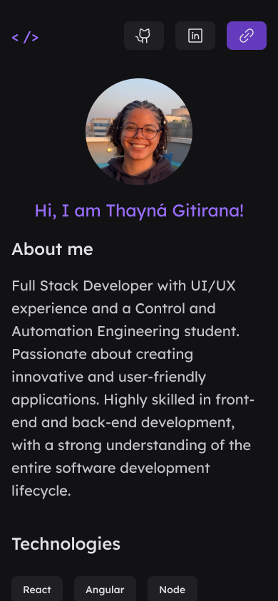
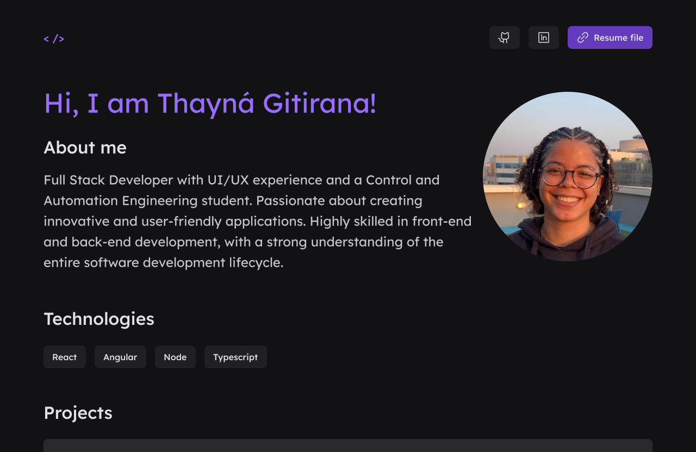

<h1 align="center">Portfolio</h1>
<p align="center">App developed with ReactJS and styled components to show my projects, experiences and skills.</p>

<p align="center">
  

  
  
  <a href="https://github.com/tgmarinho/README-ecoleta/commits/master">
    
  </a>
    
   
   <a href="https://github.com/gitirana/portfolio/stargazers">
    
  </a>

  <a href="https://rocketseat.com.br">
    
  </a>
</p>

<p align="center">
 <a href="#features">Features</a> • 
 <a href="#prerequisites">Prerequisites</a> • 
 <a href="#how-to-install">How to install</a> • 
 <a href="#technologies">Technologies</a> • 
<a href="#tech-stack">Tech Stack</a> • 
 <a href="#app-demo">Application demo</a> • 
 <a href="#utilities">Utilities</a> • 
 <a href="#author">Author</a>
</p>


<h3>Features</h3>

<ul>
  <li>[x] See my GitHub projects</li>
  <li>[x] See my work experience</li>
  <li>[x] Contact me</li>
  <li>[x] Responsive</li>
</ul>

<h3>Layout</h3>
The application layout is available on Figma:

<a href="https://www.figma.com/file/UsAqwmXW0brw3er6TYUSop/Portfolio?type=design&node-id=0%3A1&mode=design&t=NphUhPssyGnbckKH-1">
  
  
</a>

### Mobile

<p align="center">
  
</p>

### Web

<p align="center" style="display: flex; align-items: flex-start; justify-content: center;">
  
</p>

<h3>Prerequisites</h3>

<p>Before you start, you will need to have the following tools installed on your machine: 
<a href="https://git-scm.com">Git</a>, <a href="https://nodejs.org/en/">Node.js</a>.
Also, it's good to have an editor to work with the code like <a href="https://code.visualstudio.com/">VSCode</a>.</p>

<h3>How to install</h3>

```bash
# Clone this repository
$ git clone <https://github.com/gitirana/portfolio>

# Access the project folder in the terminal/cmd
$ cd portfolio

# Install the dependencies
$ npm install

# Run the application in development mode
$ npm run dev

# The server will start on port:3000 - access <http://localhost:3000>
```

<h3>Technologies</h3>

<p>The following tools were used in the construction of the project:</p>

<ul>
  <li><a href="https://vitejs.dev/">Vite</a></li>
  <li><a href="https://pt-br.reactjs.org/">React</a></li>
  <li><a href="https://www.typescriptlang.org/">TypeScript</a></li>
  <li><a href="https://styled-components.com/">Styled Components</a></li>
</ul>

## Tech Stack

The following tools were used in the construction of the project:

#### **Website**  ([React](https://reactjs.org/)  +  [TypeScript](https://www.typescriptlang.org/))

-   **[React Router Dom](https://github.com/ReactTraining/react-router/tree/master/packages/react-router-dom)**
-   **[Axios](https://github.com/axios/axios)**

> See the file  [package.json](https://github.com/gitirana/portfolio/blob/main/package.json)

#### **Utilities**

-   Prototype:  **[Figma](https://www.figma.com/)**  →  **[Protótipo (Portfolio)](https://www.figma.com/proto/UsAqwmXW0brw3er6TYUSop/Portfolio?page-id=0%3A1&type=design&node-id=1-1495&viewport=1001%2C331%2C0.21&scaling=scale-down-width&starting-point-node-id=1%3A1495&show-proto-sidebar=1&mode=design)**
-   API:  **[GitHub API](https://docs.github.com/pt/rest?apiVersion=2022-11-28)** 
-   Editor:  **[Visual Studio Code](https://code.visualstudio.com/)** 
-   ESLint:  **[ESLint](https://eslint.org/)**
-   Icons:  **[Phosphor Icons](https://phosphoricons.com/)**
-   Fonts:  **[Lexend](https://fonts.google.com/specimen/Lexend)**

<h3>Application demo</h3>

[](https://app.netlify.com/sites/gitirana/deploys)

If you want to use the application, access [Netlify](https://gitirana.netlify.app/).

<h4 align="center"> 
	✅ Completed! 
</h4>

<h3>Author</h3>

---


<sub><b>Thayná Luiza Gitirana</b></sub>

Made with ❤️ by Thayná Luiza Gitirana
